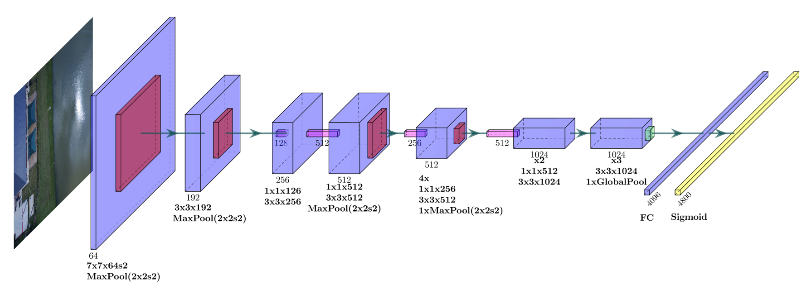

<h1> SafeNet: Prototype Lightweight ConvNet for Grid-Based Binary Classification of Safe Drone Landing Zones </h1>
<figure align="center">
    

      

        
        
        
      

      

        
        
        
      

    

    <figcaption style="font-style: italic; margin-top: 10px; text-align: center;">
        GIFs made from predictions on Test data at a 0.40 confidence threshold.   The red dots indicate "unsafe" regions predicted by SafeNet.
    </figcaption>
</figure>

## Table of Contents
1. [Overview](#overview)  
2. [Key Features](#key-features)  
5. [Dataset & Data-Pipeline](#dataset)
6. [Model Details](#model-details)
    - [Model Architecture](#model-architecture)
    - [Important Metrics & Benchmark Performance Goals](#important-metrics-&-benchmark-performance-goals)
    - [Priortizing Recall](#prioritizing-recall-weighted-binary-crossentropy-loss)
        1. Standard Binary Cross-Entropy Loss
        2. Class Weights to Improve Recall Specifically 
        3. Weighted Binary Cross-Entropy Loss
7. [Results](#performance-metrics)  
8. [Future Improvements](#future-improvements)  

---

## Overview  
SafeNet is a lightweight convolutional neural network designed for compatability with edge devices to predict safe landing zones for drones. Using a grid-based binary classification approach, it analyzes image sections to determine areas free from hazards like water, buildings, and trees.

**Why is this significant?** 
With an increased use of UAVs (unmanned aerial vehicles) in **disaster relief and warefare,** operators may encounter disconnections caused by weather, low battery, obstacles, or **GPS Jammers** and in these scenarios a protocal to land safely by just taking an image of the ground below. 

This project was my way of introducing myself to computer vision and by no means do I think this model is deployable, but I do believe that similar approach/models could solve real world problems like **aid/package delivery** or even **analyze/fight wild-fires** using the models predictions of flat areas which could help identify safe zones for landing, optimize waterbomber flight paths, or assist in assessing areas for safe operations during emergencies.

---

## Key Features  
- **Edge-Capable:** Model inferences based on entire image allowing for real time predictions on edge devices suitable for quadcopter drones. While I was unable to test my model on any industry edge devices, sub 1-second predictions ran on my Intel i7 CPU. [This article](https://medium.com/@samsterckval/google-coral-edge-tpu-vs-nvidia-jetson-nano-a-quick-deep-dive-into-edgeai-performance-bc7860b8d87a) found that the NVIDIA Jetson Nano performs similar if not better than the i7–4870HQ on machine learning tasks because of its specialized GPU architecture, which is optimized for parallel processing in machine learning tasks.

- **Grid-Based Labeling:** Divides large images into 4800 (60x80) binary labels corresponding to pixel safety (0 = "safe", 1 = "unsafe") 
- **Lightweight Model Architecture:** YOLO inspired, the model predicts the entire image rather than image kernels allowing for faster predictions compared to the alternative sliding window approach.

- **Class Weights to Prioritize Safety:** By weighting safe predictions more than unsafe predictions the model is trained to priotize recall and limit false-safe predictions. This feature is essential for deployment as losing a drone could be costly, so the model must have very high confidence for safe predictions. 
## Dataset & Pipeline 
### Dataset: FloodNet

The **FloodNet dataset** is a high-resolution UAV imagery dataset designed for post-disaster damage assessments. The images were captured after Hurricane Harvey which caused major flooding in suburban areas producing an abundance of obstacles that can be utilized during training simulating disaster relief scenarios.

#### Key Features of FloodNet:
- **10 Classes** ('Background':0, 'Building-flooded':1, 'Building-non-flooded':2, 'Road-flooded':3, 'Road-non-flooded':4, 'Water':5, 'Tree':6, 'Vehicle':7, 'Pool':8, 'Grass':9)
- **Total Images:** 2343 (Train: 1445, Val: 450, Test: 448)
- **High-Resolution UAV Imagery:** Provides detailed 3000x4000px images taken at a height of 200 feet with a high 1.5cm spacial resolution.  
- **Semantic Segmentation:** Pixel-wise labeling allows masks that can be used for regional classification. 

#### How My Project Uses FloodNet:
Firstly, using the original segmentation labels from the masks I needed to seperate the labels into "Safe" or "Unsafe" for classification. 

Of the 10 labels I concluded that...

Flat areas like **grass and roads/parking lots** could be considered **safe** for drone landing. I originally labeled road as unsafe but later revised as most disaster scenarios that would require drone deployment would be due to road unaccessibility, meaning that there would be no moving cars to avoid. 

I deemed any **background, buildings, flooded-roads, water, trees, pools, or vehicles** as unsafe which is self-explanatory. 

Then using the masks I was able to create 60 row x 80 colomn binary labels for each image. This was excuted by sliding a 50x50px across the masks with a step of 10px if the window contained more than 20% "unsafe" pixels a 1 would be placed in the label corresponding to that region of the original photo. Using region based labels I avoided having to execute a sliding window algorithm for post training inferencing. If I had used a sliding window post-training I would've had to make the model predict every region of an image which causes far more latency in terms of runtime and is far less effective than classifying the entire image.

#### Accessing the Dataset:
The FloodNet dataset is publicly available and can be downloaded from the [official repository](https://github.com/BinaLab/FloodNet-Supervised_v1.0).

### Data Pipeline 
<html>
<head>
    
</head>
<body>
    
</body>
</html>

1. First, I took the original 3000x4000px FloodNet dataset and for each image/mask I resized down to 600x800px. 
2. I then used the Albumentations library to **5x the amount of training data** using data augmentation techniques like random flips/rotations, random lighting, etc. 
3. Then taking the resize/augmented images and masks I ran the previously discussed sliding window to generate labels for each image that were stored in CSV files making them easily accessible. 

## Model Details 
### Model Architecture 
<html>
<head>
    
</head>
<body>
    <figure>
        
        <figcaption class="caption">SafeNet Architecture Diagram   Input = (600x800x3) Purple = Conv2D,ReLU   Red = MaxPool,(2x2),stride = 2   Pink = Pointwise,(1x1),ReLU Green = GlobalPool Yellow = Sigmoid</figcaption>
    </figure>
</body>
</html>

#### Key Features 

1. **Light Weight** 
    - The general goal of the model architecture was to minimize runtime for forward pass to the model. While designing, I often tested for FLOPs (floating-point operations per second), which is not a concrete and has its limitations, In order to gain general insight into possible model performance. 
    - One may notice that the architecture is very similar to **YOLOv1**, aside from minor dimensional/layer changes, as YOLO has been shown to perform well on bounding-box object detection. Considering this task requires a similar approach, with the difference being the model isn't predicting boxes then performing Non-Max Suppression (NMS), but instead the model is classifying the image cells. 
    

2. **Pooling, Downsampling, & Pointwise Convolutions** 
    - The model uses **Maxpooling, strided convolutions, and pointwise(1x1) convolutions** for spatial reduction, minimizing computational overhead while preserving critical information.

3. **Grid-Based Prediction**  
- As previously mentioned, the 4800x1 sigmoid output layer is essentially a 60x80 grid of 10x10 regions of the image where each value in the output vector corresponds with the models confidence of whether the region is "unsafe." 

4. **Note** 
- The current model is **not** yet pruned or quantized which leaves extra room for future runtime advancements. 

### Important Metrics & Benchmark Performance Goals.

1. **Recall** 
    - **Most Important, Goal >95%** 
    - Measures the proportion of actual unsafe regions that are correctly identified.
    - Important for minimizing false negatives (e.g., missing an unsafe region).
    - Losing a drone is expensive so we want to maxmize our models predictions of unsafe regions, recall gives us this insight. 
2. **Precision**
    - Indicates the proportion of predicted unsafe regions that are actually unsafe.
3. **F1 Score** 
    - **2nd Priority, Goal >80%** 
    - The harmonic mean of precision and recall.
    - Balances the trade off between recall and precision, without, our model would predict every region as "unsafe" to maxmize recall.  
    - Since our task prioritizes recall an F1 score of greater than 80% will indicate that our model has a decent ratio for unsafe/safe predictions while still allowing high recall. 
4. **Binary Accuracy**
    - Measures the percentage of correct predictions across all grid regions.
    - Gives general measure of model performance.

Note that all these metrics are influenced by adjustments to the confidence threshold. 

### Prioritizing Recall (Weighted Binary Crossentropy Loss)
#### Standard Binary Crossentropy Loss

$$
\text{Binary Cross-Entropy Loss} = -\frac{1}{N} \sum_{i=1}^{N} \left( y_i \cdot \log(p_i) + (1 - y_i) \cdot \log(1 - p_i) \right)
$$
Where:
- \( N \) is the number of samples.
- \( y_i \) is the true label (either 0 or 1) for sample \( i \).
- \( p_i \) is the predicted probability that the label is 1 for sample \( i \).

#### Class Weights to Improve Recall Specifically
- Incorporating a larger weight to unsafe predictions makes misclassifying an unsafe region as safe becomes costlier to our loss function during training. 
- This pushes the model to better predict unsafe regions, directly improving recall. 

#### Weighted Binary Crossentropy Loss
$$
\text{Weighted Binary Cross-Entropy Loss} = -\frac{1}{N} \sum_{i=1}^{N} \left( w_1 \cdot y_i \cdot \log(p_i) + w_0 \cdot (1 - y_i) \cdot \log(1 - p_i) \right)
$$

Where:
- \( N \) is the number of samples.
- \( y_i \) is the true label (either 0 for safe or 1 for unsafe) for sample \( i \).
- \( p_i \) is the predicted probability that the label is 1 (unsafe) for sample \( i \).
- \( w_1 \) and \( w_0 \) are the class weights for unsafe and safe regions, respectively.

**SafeNet was trained with weights w0 = 1 & w1 = 1.5** 

    

